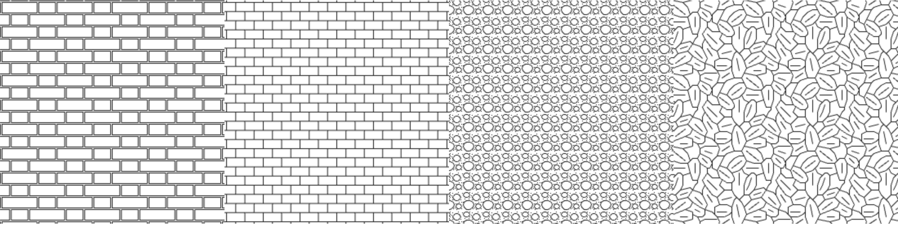

# PAT to Canvas TS Converter

PAT to Canvas Converter is a TypeScript-based library for converting PAT (Pattern) files into HTML Canvas elements. This library simplifies the process of displaying patterns in web applications and offers seamless integration with modern web technologies.

[](LICENSE)



## Features

- Convert PAT files to HTML Canvas elements
- Written in TypeScript for type safety and better developer experience
- Easy integration with web applications
- Maintain the integrity of the original pattern data
- Customizable rendering options

## Usage

Here's a quick example of how to use the PAT to Canvas Converter:

```typescript
import { loadPatFile, drawPattern } from './path-to/index.ts';

// Load a PAT file
loadPatFile('/patterns/HBFLEMET.pat', (pattern) => {
  // Get the canvas element
  const canvas = document.getElementById('myCanvas');

  // Draw the pattern on the canvas
  drawPattern(canvas, pattern);
});
```
